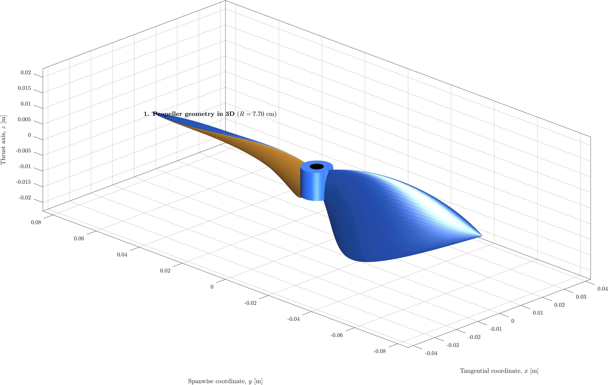
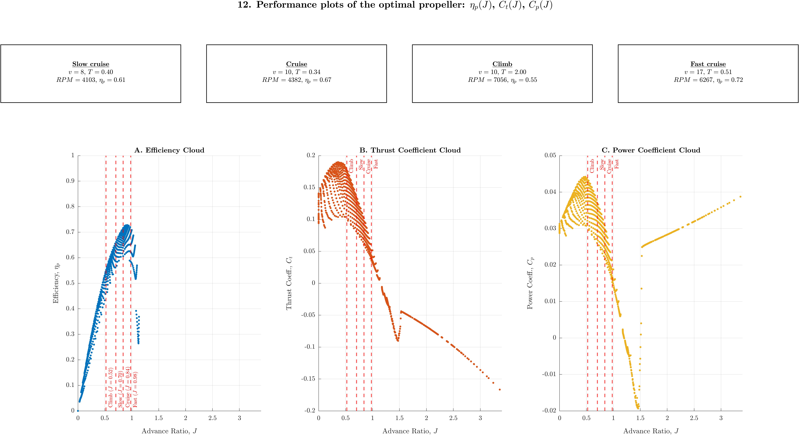

# Propeller Optimization for Mission Profiles considering Structural and Motor Constraints

This project implements a multiphysics design framework that optimizes propeller geometry (chord and twist) for weighted average efficiency across a 4-stage mission profile. It utilizes a hybrid Genetic Algorithm (GA) and SQP approach, coupling a Modified Momentum Theory (SABEMMT) aerodynamic solver with a brushless motor model to ensure designs meet strict structural, aerodynamic and electrical limits.

## Overview

This repository presents a **mission-oriented propeller optimization framework** developed in MATLAB for electrically driven aircraft and UAV applications. Unlike conventional approaches that optimize propeller performance at a single operating condition (typically cruise), this framework designs a *single propeller geometry* (fixed-pitch propeller) that performs optimally across an **entire mission profile**, subject to **aerodynamic, structural, and electric motor constraints**.

The optimization simultaneously determines blade **twist and chord distributions**, propeller **radius**, and **segment-specific RPM scaling**, ensuring physically realizable solutions that remain within motor electrical limits and structural stress bounds.

<p align="center">
  
  
</p>

---

## Table of Contents

- [Key Features](#key-features)
- [Project Structure](#project-structure)
- [Installation and Requirements](#installation-and-requirements)
- [Usage Guide](#usage-guide)
- [Configuration Options](#configuration-options)
- [Optimization Workflow](#optimization-workflow)
- [Theoretical Background](#theoretical-background)
- [License](#license)

---

## Key Features

### Mission-Based Optimization

The propeller is optimized for a **weighted four-segment mission profile**, rather than a single design point.

**Default mission weighting:**
- Slow cruise: 10%
- Nominal cruise: 70%
- Exigent climb: 15%
- Fast cruise: 5%

This formulation explicitly accounts for off-design operating conditions that strongly influence real-world performance.

### Multiphysics Solver (SABEMMT)

The core solver combines aerodynamic and structural analyses in a unified framework:

**Aerodynamics**
- Blade Element Momentum formulation with **Modified Momentum Theory (MMT)**
- Robust convergence in static thrust, climb, and turbulent wake regimes
- Prandtl tip-loss correction
- Reynolds-number-dependent airfoil polars

**Structures**
- Blade modeled as a cantilever beam
- Combined centrifugal and aerodynamic bending loads
- Spanwise evaluation of Von Mises stress

### Electric Motor Coupling

The propeller model is explicitly coupled to a **brushless DC motor model** (e.g., T-Motor AS2304 1500 kV), enforcing:

- Battery voltage limits
- Maximum current constraints
- Physically consistent torque–speed operating points for each mission segment

This ensures that all optimized designs are electrically feasible.

### Hybrid Optimization Strategy

A two-stage optimization approach is employed:

1. **Genetic Algorithm (GA)**  
   - Global exploration of the design space  
   - Relaxed thrust constraints to efficiently identify feasible regions  

2. **Sequential Quadratic Programming (SQP, `fmincon`)**  
   - Local refinement from the GA solution  
   - Strict equality constraints on thrust for each mission segment  

This strategy combines robustness with high solution accuracy.

### Smooth Geometry Parameterization

- Blade twist and chord are parameterized using **cubic Bézier curves**
- Low-dimensional design space with guaranteed smoothness
- Suitable for manufacturing and structural analysis

---

## Project Structure

```text
propeller-optimization-mission-motor/
├── main_runner.m                 # Entry point: mission definition and execution
├── run_optimization.m            # GA + SQP optimization loop
├── functions/
│   ├── runSABEMMT.m              # Aerodynamic and structural solver
│   ├── evaluateObjectives...m    # Objective function and constraints
│   ├── evaluateModels.m          # Propeller–motor coupling
│   ├── getPropGeometry.m         # Bézier-based geometry generation
│   └── ...                       # Auxiliary functions and airfoil databases
├── results/                      # Logs, .mat files, and figures
└── docs/                         # Theoretical background and documentation
```

## Installation and Requirements

### Software Requirements

- MATLAB R2021a or newer (recommended)
- Optimization Toolbox (required for `fmincon`)
- Global Optimization Toolbox (required for `ga`)

### Installation

Clone the repository:

```bash
git clone https://github.com/your-username/propeller-optimization-mission-motor.git
```

Open MATLAB and navigate to the project root directory.

The `functions/` directory is automatically added to the MATLAB path by the main script.

---

## Usage Guide

### 1. Define the Mission Profile

Open `main_runner.m` and modify **Section 1** to define the flight conditions and mission weights:

```matlab
% Example mission definition
mission.v_ref   = [ 7.8, 10.0, 10.0, 16.7 ]; % Flight velocity [m/s]
mission.T_ref   = [ 0.4,  0.3,  2.0,  0.5 ]; % Thrust targets [N]
mission.weights = [ 0.1,  0.7, 0.15, 0.05 ]; % Segment weights
```

### 2. Run the Optimization

Execute the main script from the MATLAB Command Window:

```matlab
main_runner
```

### 3. Analyze the Results

**Console Output**
- Real-time optimization progress
- Final constraint satisfaction summary

**Saved Outputs (`results/`)**
- `optimization_results.txt`: Complete optimization log
- `SQP_final_result.mat`: Final optimized design variables
- `*.jpg`: High-resolution plots of geometry, loads, stresses, and performance

---

## Configuration Options

The following parameter groups can be customized in `main_runner.m`:

| Struct | Key Parameters | Description |
|------|---------------|-------------|
| `mission` | `v_ref`, `T_ref`, `weights` | Flight conditions and mission weighting |
| `motor` | `KV`, `Rm`, `I0`, `I_max` | Motor electrical parameters |
| `prop` | `Nb`, `M_tip_max` | Number of blades and tip Mach limit |
| `material` | Density, stress limits | Structural properties |
| `optconstr_flags` | Boolean flags | Enable/disable thrust, stress, current constraints |

---

## Optimization Workflow

The optimization problem includes **12 design variables**:

- \( x_{1–4} \): Twist Bézier control points  
- \( x_{5–7} \): Chord Bézier control points  
- \( x_8 \): Propeller radius  
- \( x_{9–12} \): RPM scaling factors for each mission segment  

### Phase 1: Global Optimization (GA)

- Broad exploration of the design space
- Thrust constraints enforced as tolerance bands (e.g., ±30%)
- Improves convergence robustness

### Phase 2: Local Refinement (SQP)

- Initialized from the best GA solution
- Strict equality constraints on thrust
- Produces a mission-compliant, physically consistent design

---

## Theoretical Background

### SABEMMT Solver

The solver implements **Structures And Blade Element Modified Momentum Theory (SABEMMT)**. For a complete mathematical derivation of the model, including the structural equations, please see the [**Technical Documentation (PDF)**](docs/The_SABEMMT_Aerodynamic_and_Structural_Model_for_Propellers.pdf).

#### Modified Momentum Theory

- Extends classical BEMT to maintain validity in turbulent wake and vertical descent conditions
- Based on constitutive relations proposed by Cuerva et al. (2006)

#### Structural Model

- Blade treated as a cantilever beam
- Aerodynamic and centrifugal loads integrated along the span
- Von Mises stress evaluated at critical sections

**Reference**

Cuerva, A., Sanz-Andrés, A., Meseguer, J., & Espino, J. L. (2006).  
*An Engineering Modification of the Blade Element Momentum Equation for Vertical Descent*.  
Journal of the American Helicopter Society.

---

## License

**Author:** Miguel Frade  
**Affiliation at time of publication:** Universidad Politécnica de Madrid  
**Date:** December 2025  

This project is licensed under the **Creative Commons Attribution–NonCommercial 4.0 International (CC BY-NC 4.0)** license.

The code may be used, modified, and redistributed for **academic and non-commercial purposes**.  
If this repository contributes to published research, citation of the project is appreciated.


